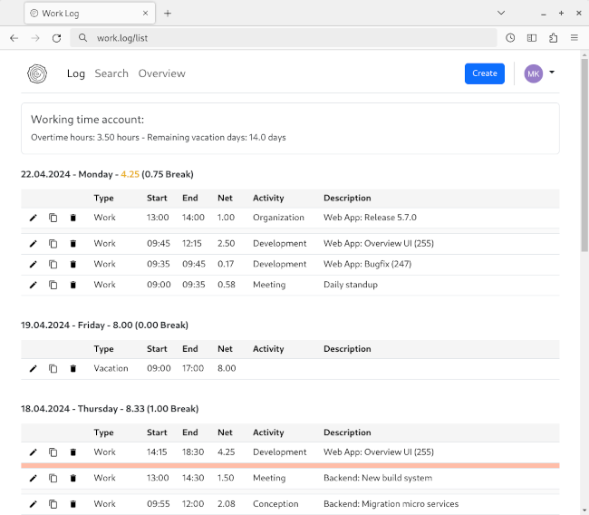

# Work Log

A simple Go web application for tracking working hours and activities.



## Features

- User accounts
  - with role-based permissions (admin, evaluator and user)
  - with contract details like first work day, daily working hours and annual vacation days
- UI
  - Log View (screenshot): to show recent entries (with summary and gap/conflict highlighting)
  - Search View: to search entries by type, date, ...
  - Overview View: to show a monthly overview and export a timesheet
  - responsive 
  - localizable
- API (RESTful / JSON)
  - Swagger API documentation + Swagger UI
  - with endpoints to query/maintain user accounts
  - with endpoints to query/maintain entry types & entry activities
  - with endpoints to query/maintain entries

## Installation

The application is available as a Docker image or a compiled binary.

Before you can start Work Log you need to create a configuration file. See
[Configuration](#configuration) for more information.

### Prerequisites

Application data is stored in a database, therefore one of the following databases is needed:

- MySQL (version >= 5.5)
- MariaDB (version >= 5.5)

(To setup the database user and schema, you can use [this](db-init.sql) initialization script.)

### Docker

The Docker image is available at `ghcr.io/mkellnhofer/work-log:1.4.0`.

Images are only provided for `linux/amd64`, `linux/arm64` and `linux/armv7`. For other
architectures you have to build them yourself.

__Here is an example usage:__

```bash
docker run \
  --name work-log \
  --volume /config/config.ini:/app/config/config.ini \
  --publish 8080:8080 \
  ghcr.io/mkellnhofer/work-log:1.4.0
```

(You can also use [this](docker-compose.yml) example Docker Compose file.)

### Standalone

The standalone binary can be found at [releases](https://github.com/mkellnhofer/work-log/releases).

Binaries are only provided for Linux (`amd64`, `arm64` and `arm`). For other systems you have to
build them yourself. See
[this](https://dave.cheney.net/2015/08/22/cross-compilation-with-go-1-5) blog post for how to cross
compile Go code.

1. Extract the archive with `unzip work-log-1.4.0.zip -d work-log`
2. Go to the directory that was just created
3. Execute `./work-log`

## Configuration

__Basic configuration__

Basic configuration is done in file `/config/config.ini`. This file does not exist by default. Copy
the example configuration file and adjust it accordingly.

After this is done, you can start Work Log. &#x1F642;

__Master data & user configuration__

Currently, there is no UI to configure master data and users. You have to use the API here. By
default there is a admin user. You can use this user to configure entry activities and create
further users.

__Admin User__
- username: `admin`
- password: `admin`

The password of a new user must be changed, before the user can use the UI or API. This is also the
case for the admin user. Log in via the UI or use the API (`POST /user/password`) to set a new
password.

## Operation / Infrastructure

Work Log has low minimal requirements and can run on an inexpensive Raspberry Pi.

I would recommend to use a reverse proxy e.g. Nginx which does TLS offloading. (See
[Nginx documentation](https://docs.nginx.com/nginx/admin-guide/web-server/reverse-proxy/) for how to
configure Nginx as a reverse proxy and
[this](https://www.digitalocean.com/community/tutorials/how-to-secure-nginx-with-let-s-encrypt-on-ubuntu-18-04)
tutorial for how to secure Nginx with a Let's Encrypt certificate.)

## API Documentation

The Swagger API documentation is available under `/api`.

## Copyright and License

Copyright Matthias Kellnhofer. All rights reserved.

Licensed under the Apache License, Version 2.0 (the "License"); you may not use this file except in
compliance with the License. You may obtain a copy of the License at

http://www.apache.org/licenses/LICENSE-2.0

Unless required by applicable law or agreed to in writing, software distributed under the License is
distributed on an "AS IS" BASIS, WITHOUT WARRANTIES OR CONDITIONS OF ANY KIND, either express or
implied. See the License for the specific language governing permissions and limitations under the
License.